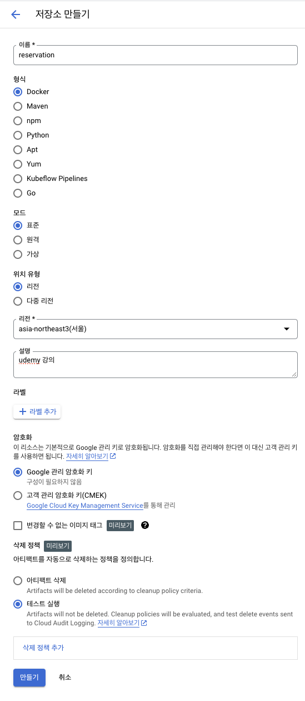
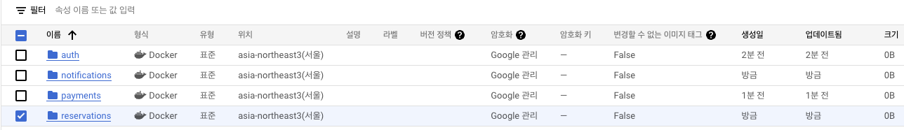

# 강의

강의 : https://www.udemy.com/course/nestjs-microservices-build-deploy-a-scaleable-backend/  
github : https://github.com/mguay22/sleepr

## 초기 셋팅

- 프로젝트 생성  
  `nest new nestjs-microservices-build-deploy-a-scaleable-backend`  
  => pnpm 선택

- 의존성 설치  
  `pnpm install`

- mono repo 셋팅 :: common 라이브러리 생성  
  `nest generate library common`  
  => What prefix would you like to use for the library (default: @app)? 엔터

## Database(MongoDB)

- 의존성 설치  
  `pnpm i @nestjs/mongoose mongoose`

- common library에 database module 추가  
  `nest generate module database -p common`

- libs/common에서 파일 삭제

  - common.module.ts
  - common.service.ts
  - common.service.spec.ts

- database 생성

  - mongodb 컨테이너에 접속  
    `docker exec -it {컨테이너 이름}`
  - mongo 접속  
    `mongo -u root -p`
  - database 생성  
    `use sleepr`  
    `db.sleepr.insert({name:"mongodb"})`
    > 새로운 document까지 생성해야 database 생성이 완료 됩니다.
  - 계정 생성  
    `use sleepr`

    > 계정을 생성할 database 선택

    `db.createUser({user:"sleepr", pwd: passwordPrompt(), roles: ["readWrite"]})`

    > 비밀번호 입력창이 나오면 비밀번호 입력

## config

- 의존성 설치  
  `pnpm i @nestjs/config`

- common library에 config module 추가
  `nest generate module config -p common`

- 의존성 설치  
  `pnpm i joi`

## validator

- 의존성 설치
  `pnpm i --save class-validator class-transformer`

## Logging

- 의존성 설치
  `pnpm i nestjs-pino pino-http`

- 의존성 설치(추가)
  `pnpm i pino-pretty`

## dockerize

- docker build command  
  `cd ./apps/reservations`  
  `docker build ../../ -f Dockerfile -t sleepr_reservations`  
  docker buile 뒤의 경로는 context 입니다. 다시 말해 docker 빌드 시 root로 지정될 경로 입니다.

- docker run command  
  `docker run sleepr_reservations`  
  위 명령어를 실행하면 MONGODB_URI가 없다고 메시지가 나옵니다.  
  환경변수를 적용하기 위해 docker-compose를 사용합니다.

- debugging  
   package.json의 디버깅 스크립트에 `0.0.0.0:9299`를 추가 합니다.  
   ` "nest start --debug 0.0.0.0:9229 --watch"`

  vscode에서 디버깅을하려면 launch.json에서`Node.js: 원격프로그램에 연결` 코드 어시스트로 추가 합니다.

  ```json
  {
    // IntelliSense를 사용하여 가능한 특성에 대해 알아보세요.
    // 기존 특성에 대한 설명을 보려면 가리킵니다.
    // 자세한 내용을 보려면 https://go.microsoft.com/fwlink/?linkid=830387을(를) 방문하세요.
    "version": "0.2.0",
    "configurations": [
      {
        "type": "node",
        "request": "attach",
        "name": "debug:attach-reservations",
        "address": "localhost",
        "localRoot": "${workspaceFolder}",
        "sourceMaps": true,
        "restart": true,
        "port": 19229,
        "remoteRoot": "/usr/src/app"
        // "skipFiles": ["<node_internals>/**"]
      }
    ]
  }
  ```

  중단점을 설정한 후 API를 요청해봅니다.

## passport

- 의존성 설치
  `pnpm i @nestjs/passport passport passport-local`
  `pnpm i -D @types/passport-local`

## jwt

- 의존성 설치
  `pnpm i @nestjs/jwt passport-jwt`
  `pnpm i -D @types/passport-jwt`

- 의존성 설치(쿠키)
  `pnpm i cookie-parser`
  `pnpm i -D @types/cookie-parser`

## bcrypt

- 의존성 설치
  `pnpm i bcryptjs`
  `pnpm i -D @types/bcryptjs`

## microservice

- 의존성 설치
  `pnpm i @nestjs/microservices`

## stripe(결제모듈)

- 의존성 설치
  `pnpm i stripe`

- 의존성 설치
  `pnpm i nodemailer`
  `pnpm i @types/nodemailer`

## 프로덕션 배포

### docker

- docker build
  `cd apps/reservations`
  `docker build -t reservations -f . ../../`
  각각의 서비스의 도커 이미지 생성

- package.json 분리
  `cd apps/auth`
  `pnpm init`

## 의존성 전체 설치

root 경로에서 아래 명령어를 실행합니다.
`pnpm i -r`

각각의 하위 모듈에 필요한 의존성만 추가되어 node_modules 파일이 생성됩니다.

### GCP Artifact Registry

1. Google Artifact Registry 사용 허용(Contianer Registry는 EOF)
2. 저장소 만들기




3.  gcloud 프로젝트 셋팅  
    `gcloud config set project {{프로젝트 ID}}`

4.  홈페이지 상단 '설정안내'에 따라 진행하기

    1. gcloud sdk 설치
    2. 인증하기
    3. 도커 구성하기 명령어 실행하기

5.  Artifacts Repository 리스트 확인  
    `gcloud artifacts repositories list`

6.  도커 이미지 빌드  
    `cd apps/reservations && docker build -t reservations -f . ../../`

7.  도커 태그 추가 및 푸쉬  
    `docker tag reservations asia-northeast3-docker.pkg.dev/x-plateau-409309/reservations/production`

        위 명령어를 입력하고 도커 이미지를 확인하면 다음과 같이 보입니다.
        ```
        REPOSITORY                                                                TAG       IMAGE ID       CREATED         SIZE
        asia-northeast3-docker.pkg.dev/x-plateau-409309/reservations/production   latest    bbb80e78440e   3 minutes ago   207MB
        reservations                                                              latest    bbb80e78440e   3 minutes ago   207MB
        ```

        도커 이미지 푸쉬
        `docker image push asia-northeast3-docker.pkg.dev/x-plateau-409309/reservations/production`

### GCP Cloud Build
1. Cloud 빌드 대시보드에서 '빌드 트리거 설정' 클릭

### helm

- k8s 폴더 생성
  `mkdir k8s`

- k8s로 이동
  `cd k8s`

- 헬름 차트 생성
  `helm create sleepr`

- 헬름 템플릿 삭제
  `rm -rf sleepr/templates/*`

- values.yaml 내용 삭제

- 예약 deployment 생성
  `kubectl create deployment reservations --image=todo/reservations/production --dry-run=client -o yaml > deployment.yaml`

- 만들어진 파일을 templates/reservations 폴더를 만들고 옮깁니다.

- 헬름을 실행합니다.
  `cd k8s/sleepr`
  `helm install sleepr .`

- pod가 생성되었는지 확인 합니다.
  `kubectl get pod`

- 컨테이너가 생성되었지만 Ready 상태가 이상 있으므로 describe 명령어로 pod를 확인 합니다.
  `kubectl describe pod 'pod이름'`

- gcr 권한이 없어서 이미지를 다운받지 못하므로 구글클라우드에서 계정 키 설정 후 쿠버네티스에 다음과 같이 설정 합니다.
  `kubectl create secret docker-registry gcr-json-key --docker-server=abc --docker-username=_json_key --docker-password="$(cat ./test_key.json)" --docker-email=sleeprnestapp@gmail.com`

- 서비스계정의 설정을 변경 합니다.
  `kubectl patch serviceaccount default -p '{"imagePullSecrets": [{"name": "gcr-json-key"}]}'`

- 예약 deployment를 재실행 합니다.
  `kubectl rollout restart deployment reservations`

- minikube 설정
  minikube start
  eval $(minikube -p minikube docker-env --shell=bash)

## 이 프로젝트에서 중요하다고 느낀점

- docker 개발 환경
  서비스 API를 띄우기 위해 로컬에서 npm 명령어를 입력했는데 docker 컨테이너를 통해 개발하고 디버깅하는 방법도 나쁘지 않은 것 같다.
  오히려 한층 더 운영 환경에 가깝게 테스트할 수 있어서 혹시 모를 버그를 미연에 방지할 수 있는 것 같다.

- pino logger
  서비스 운영 시 어떤 요청에 의해 예외, 쿼리 등이 실행되었는지 추척이 어려운.데, pino logger를 적용하면 각 log마다 추척 id가 있어서 로그 추척이 편하다.

- jwt cookie 인증
  기존엔 항상 jwt의 accessToken을 복사하여 스웨거 security에 붙이는 방식으로 테스트했는데, jwt를 쿠키로 관리 방법이 더 간편하다.

## 쿠버네티스 연동

도커 이미지 빌드
Cloud의 Private Container Registry에 도커 이미지 푸쉬
